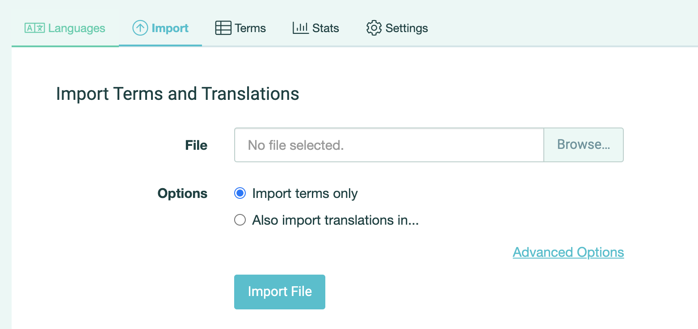

# Translations

We currently also offer hazebot in Spanish, and have built the tooling to expand langugage offerings with additional interest or contributions. Our current process is a bit clunky and we welcome contributions to improve the process or translation quality. 

As we currently constructed, if you add in new strings (i.e. new commands) you must add in a corresponding translation or it will break the non-english services. 

We use http://babel.pocoo.org/en/latest/index.html to wrap strings and https://poeditor.com/ to manage our translation library. You must translate the strings themselves into the non-english langugae. Ideally we would have a bilingual volunteer lead the translation efforts, but Google Translate works for most cases. 

Translation documents are found in the translation folder, with a corresponding .mo and .po file for each language. You can edit this file directly, but you must generate a new .mo file using the babel `compile` command. 

### To Support Existing Spanish Services Using Poeditor 
1. You'll need an account with poeditor. Ping Ian or Will and we can add you to the hazebot Spanish project. 
1. `pip3 install Flask-Babel`
1. Make sure that all strings that are within functions are wrapped with `gettext`. For strings that are declared at the top-level (e.g., within a class body, but *not* within a method), you will need to use `lazy_gettext`. 
1. Once you've wrapped all your strings, cd into the `app` directory and run `pybabel extract -F babel.cfg -k lazy_gettext -o messages.pot .`. This will update the `.pot` file.
1. Log into Poeditor, and select the "Spanish 2" project.
1. Click "Import". You should see a screen like this:

1. Select your update `.pot` file and click "Import File".
1. Go back to the "Langauges" tab and select "Spanish".
1. Enter translations for your new and updated strings.
1. Select the "Export" tab and export your strings as a `.po` file. Replace the existing `.po` file at `app/translations/es/LC_MESSAGES` with this file.
1. Run `pybabel compile -d translations` to update the `.mo` file which contains the compiled translations used by the hazebot runtime. 
1. Run hazebot locally to check your translations are correct.
1. Commit your changes.

### To Add a New Language 
1. Got an idea for a new language? Ping Ian or Will. We want to make sure that hazebot is accessible to all, but we have found that new langugaes does slow down our velocity.
